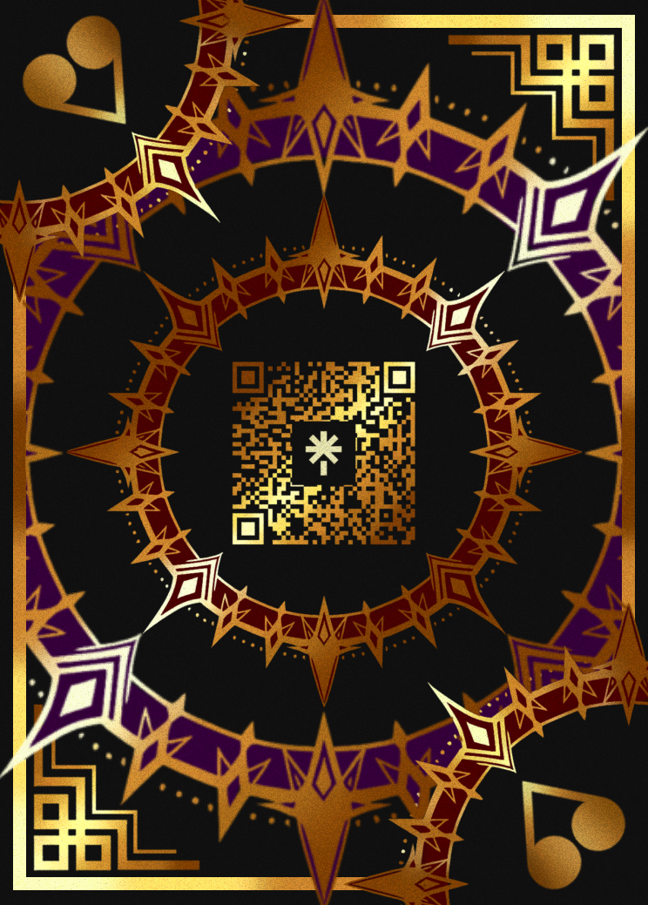
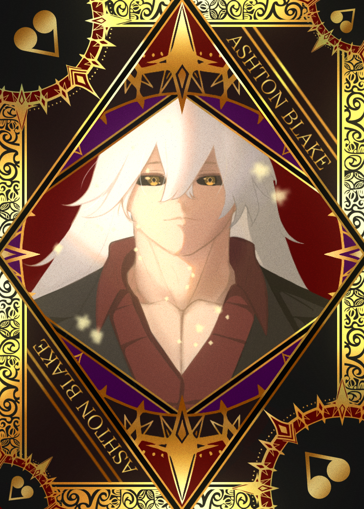
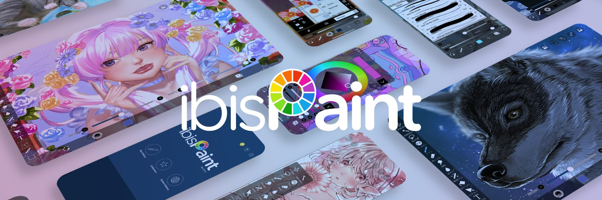
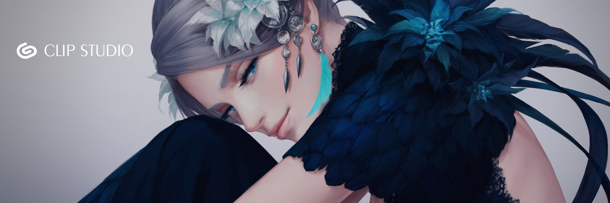
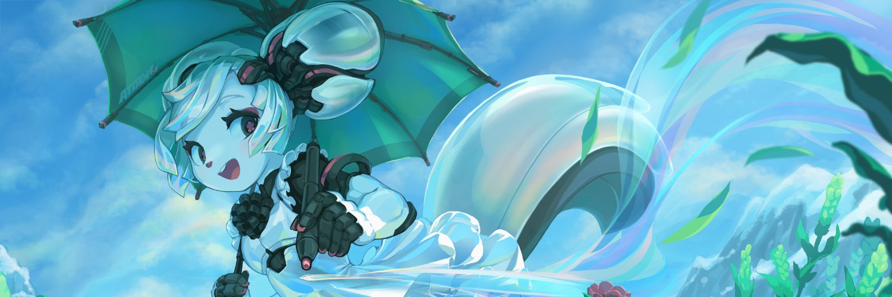
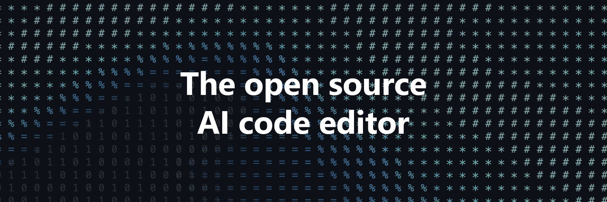
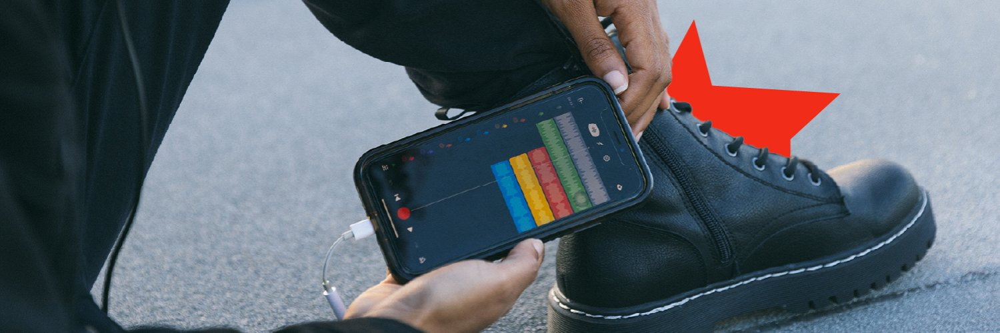

<!-- Banner -->
<h1> Hello There </h1>

	
 

---

<!-- Introduction -->
 
<h1>About Me</h1>

 

  
 

 <h4 align="center">
	My name is Ashton Blake, a professional Digital Artist working in the field of digital illustration with experience in developing visual concepts and creative works based on digital art.
 <!-- Job & Areas of Experties -->
 <h3 align="center">Job & Areas of Expertise :</h3>
 <li>Front-end Developer 
 <li>Digital Illustrator 
 <li>Musician 

---

<!-- My Work -->
<h1 align="center">My Work</h1>

Click Here

 <!--Recently Artwork-->
 <h2>Illustration</h2>
 <!--Section 1-->
  

    
	
  

 <!--Section 2-->
  

	
	
  

---

<h1 align="center">Recommended App to Use</h1>

 
click here

 <!-- App I Recently Use -->

 ---

 <h2>ibisPaint</h2>
 

    
 

 ---

 <h2>Clip Studio Paint</h2>
 

    
 

 ---

 <h2>Krita</h2>
 

    
 

 ---

 <h2>Visual Studio Code</h2>
 

    
 

 ---

 <h2>BandLab</h2>
 
	
	
 

---
<h1 align="center">Tech Stack</h1>

 
Click Here

 <!-- Tech Stack -->
 

    
    
    
    
 

---
<h1 align="center">Connections</h1>

 
Click Here

 <!-- Connections 1 -->
 

    
 

 <!-- Connections 2 -->
 

    
	
    
    
    
 

 <!-- Connections 3 -->
 

    
    
    
    

---